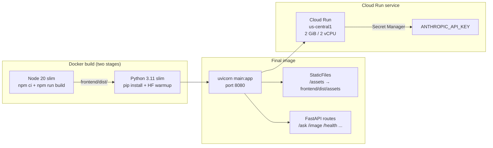
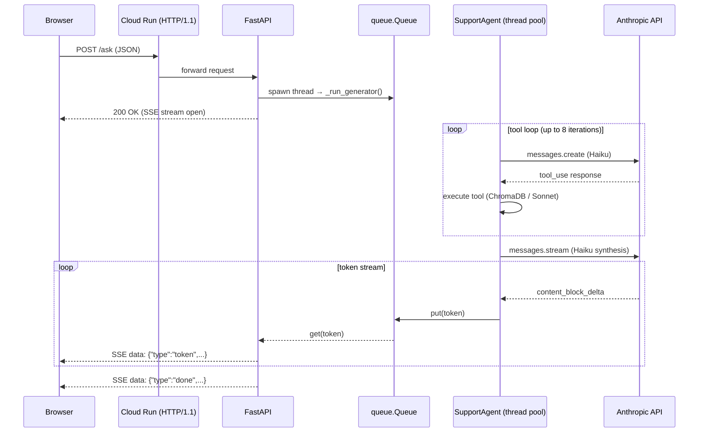

# Deployment — GCP Cloud Run

The app runs as a single container: FastAPI backend + pre-built React SPA on port 8080. The only secret needed at runtime is `ANTHROPIC_API_KEY`.

---

## Container architecture



---

## Build and deploy

```bash
# 1. Authenticate
gcloud auth login
gcloud config set project YOUR_PROJECT_ID

# 2. Enable required APIs (one-time)
gcloud services enable run.googleapis.com cloudbuild.googleapis.com secretmanager.googleapis.com

# 3. Store the Anthropic key in Secret Manager
echo -n "sk-ant-..." | gcloud secrets create ANTHROPIC_API_KEY --data-file=-

# 4. Build and push the image via Cloud Build (no local Docker required)
gcloud builds submit --tag gcr.io/YOUR_PROJECT_ID/diagnostiq .

# 5. Deploy
gcloud run deploy diagnostiq \
  --image gcr.io/YOUR_PROJECT_ID/diagnostiq \
  --region us-central1 \
  --platform managed \
  --allow-unauthenticated \
  --memory 2Gi \
  --cpu 2 \
  --min-instances 0 \
  --timeout 300 \
  --set-secrets ANTHROPIC_API_KEY=ANTHROPIC_API_KEY:latest
```

`--timeout 300` covers long tool loops (up to 5 Haiku calls + 1 Sonnet call). Default is 60 s, which is too short for rate-limit retries.

---

## Why 2 GiB

| Component | Memory |
|-----------|--------|
| sentence-transformers model | ~380 MB |
| ChromaDB in-memory index | ~100–200 MB |
| Python runtime + libraries | ~300 MB |
| FastAPI workers + response buffers | ~500 MB |
| **Total** | **~1.3–1.4 GB used** |

2 GiB leaves ~600 MB headroom. Requests spike memory during embedding and ChromaDB query. 1 GiB OOMs on the first request.

---

## Cold start

The Dockerfile runs a warm-up step during build:

```dockerfile
ENV HF_HOME=/app/.cache/hf
RUN python -c "from sentence_transformers import SentenceTransformer; SentenceTransformer('all-MiniLM-L6-v2')"
```

This downloads and caches the model weights into the image layer at build time. Cloud Run's cold start skips the download entirely — only Python imports run (~2–3 s).

`--min-instances 0` scales to zero when idle. With the model pre-baked, cold starts are fast enough for a demo or low-traffic deployment. Set `--min-instances 1` to eliminate cold starts for production traffic.

---

## Startup pre-warming

`main.py` calls `_get_agent()` in the `startup` event, which loads the embedding model and opens the ChromaDB client before the first request:

```python
@app.on_event("startup")
async def startup_event():
    _get_agent()
```

This means the first HTTP request does not pay the model-load cost.

---

## Updating the secret

```bash
# Rotate the key
echo -n "sk-ant-new..." | gcloud secrets versions add ANTHROPIC_API_KEY --data-file=-

# Cloud Run picks up the new version on next deploy (or immediately if using "latest")
gcloud run deploy diagnostiq --image gcr.io/YOUR_PROJECT_ID/diagnostiq ...
```

Using `ANTHROPIC_API_KEY:latest` in `--set-secrets` means each new deploy automatically pulls the latest version.

---

## Re-deploying after code changes

```bash
# Rebuild and push
gcloud builds submit --tag gcr.io/YOUR_PROJECT_ID/diagnostiq .

# Update the running service (same flags as initial deploy)
gcloud run deploy diagnostiq \
  --image gcr.io/YOUR_PROJECT_ID/diagnostiq \
  --region us-central1 \
  --memory 2Gi \
  --cpu 2 \
  --timeout 300 \
  --set-secrets ANTHROPIC_API_KEY=ANTHROPIC_API_KEY:latest
```

Cloud Run rolls the new revision out with zero downtime.

---

## No GCP credentials in the container

The running service does **not** need `GOOGLE_CLOUD_PROJECT` or a service account key. Vertex AI (Gemini + embeddings) is only used during ingestion, which runs locally:

```bash
# Re-ingest (local only — requires GCP credentials)
gcloud auth application-default login
uv run python run_ingest.py
# Then redeploy the updated chroma_db/ in the image
```

For the deployed service: only `ANTHROPIC_API_KEY`.

---

## Request flow on Cloud Run


