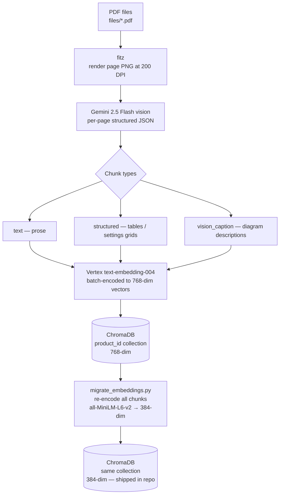
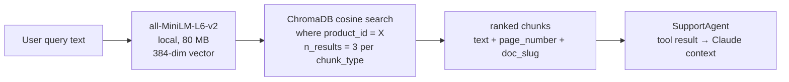

# Embedding Pipeline

Two separate embedding pipelines run at different points in the system's lifecycle. They use different models with different dimensionality. The key invariant: at query time, the query vector and the stored document vectors always use the same model.

---

## Ingestion pipeline (offline, requires GCP)



Each page goes through this pipeline in a `ThreadPoolExecutor` with `ingest_workers=3` threads. Gemini calls are rate-limited to ~4.1 s between pages to stay within the free-tier RPM limit.

---

## Serving pipeline (online, no GCP)



The embedding model is loaded once at startup (`_init_retrieval`) and reused across all requests. It runs on CPU — no GPU required.

---

## Chunk type retrieval order

`_tool_search_knowledge` queries ChromaDB three times — once per chunk type — and merges results deduplicated by chunk ID. The query order is tuned by intent:

| Query pattern | Preferred order |
|---------------|-----------------|
| Settings / specs / table | `structured` → `vision_caption` → `text` |
| Wiring / layout / "show me" | `vision_caption` → `structured` → `text` |
| Fault / error / "not working" | `text` → `vision_caption` → `structured` |
| Everything else | `vision_caption` → `text` → `structured` |

This gives structured chunks priority for settings queries (where the answer is usually in a table) and text chunks priority for fault queries (where the answer is usually in a troubleshooting section).

---

## Metadata stored per chunk

| Field | Type | Description |
|-------|------|-------------|
| `product_id` | string | Which product's collection |
| `chunk_type` | string | `text`, `structured`, or `vision_caption` |
| `page_number` | int | 0-indexed page from the source PDF |
| `doc_slug` | string | Kebab-case document name (e.g. `owner-manual`) |
| `section_title` | string | Nearest heading above this chunk |

`doc_slug` is used by `get_manual_image` and `explain-step` to resolve the correct page image path: `assets/{product_id}/pages/{doc_slug}/page_{page_number}.png`.

---

## Model specs

| Property | Ingestion (Vertex) | Serving (local) |
|----------|-------------------|-----------------|
| Model | `text-embedding-004` | `all-MiniLM-L6-v2` |
| Dimensions | 768 | 384 |
| Token limit | 2,048 | 256 |
| Size | API call | ~80 MB on disk |
| Requires | GCP credentials | none |
| Batch support | Yes (token-aware batching) | Yes (via `encode()` list) |

---

## Re-ingestion

To rebuild `chroma_db/` from scratch (e.g. after adding a new PDF):

```bash
# Requires: GOOGLE_CLOUD_PROJECT, GOOGLE_APPLICATION_CREDENTIALS
uv run python run_ingest.py

# Or POST to the running dev server:
curl -X POST http://localhost:8080/ingest \
  -H "Content-Type: application/json" \
  -d '{"product_id": "vulcan_220", "fresh": true}'
```

After ingestion, `migrate_embeddings.py` is run automatically to convert from 768-dim to 384-dim. The updated `chroma_db/` is then committed to the repo and rebuilt into the Docker image on the next deploy.
