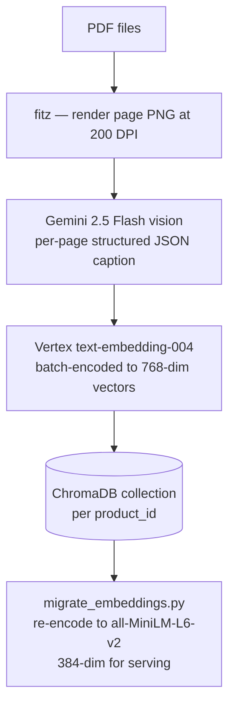
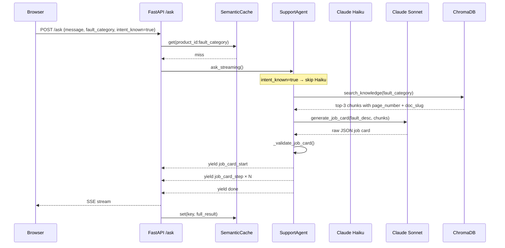

# System Overview

Diagnostiq is a multimodal technical support agent for the **Vulcan OmniPro 220** welder. It answers settings questions with interactive HTML artifacts, and turns fault descriptions into branching diagnostic job cards backed by the actual service manual.

Built directly on Anthropic's `tool_use` mechanism — no LangChain, no orchestration framework.

---

## Component map

```
┌─────────────────────────────────────────────────────────────────┐
│  Ingestion (one-time, GCP only)                                 │
│                                                                 │
│  PDF manuals                                                    │
│       │                                                         │
│       ▼                                                         │
│  ingest.py ── Gemini 2.5 Flash vision  ── structured JSON       │
│               Vertex text-embedding-004 ── 768-dim vectors      │
│                       │                                         │
│                       ▼                                         │
│               chroma_db/  (shipped in repo)                     │
│               re-embedded to all-MiniLM-L6-v2 (384-dim)        │
└─────────────────────────────────────────────────────────────────┘
                        │
                        │  (pre-built, committed to repo)
                        ▼
┌─────────────────────────────────────────────────────────────────┐
│  Serving (ANTHROPIC_API_KEY only)                               │
│                                                                 │
│  User query                                                     │
│       │                                                         │
│       ▼                                                         │
│  main.py  POST /ask  ──► agent.py  SupportAgent.ask_streaming() │
│                                    │                            │
│                           intent_known=True?                    │
│                           ┌──────┴──────────┐                  │
│                          YES               NO                   │
│                           │                 │                   │
│                           │          Haiku tool loop            │
│                           │          (search → route)           │
│                           │                 │                   │
│                    search_knowledge   tool dispatch             │
│                    generate_job_card  ┌─────┼──────┐           │
│                    (1 API call total) │     │      │           │
│                                   search  image  artifact       │
│                                           │      │             │
│                                        assets  Sonnet HTML     │
│                                                                 │
│  SSE token stream ──────────────────────────────────────────►  │
│  job_card_start / job_card_step / done events                   │
└─────────────────────────────────────────────────────────────────┘
                        │
                        ▼
┌─────────────────────────────────────────────────────────────────┐
│  Frontend  (React 19 + Vite)                                    │
│                                                                 │
│  FaultEntryBar ── text input + image attach                     │
│                                                                 │
│  ResultArea ─┬─ MarkdownText   (plain answers)                  │
│              └─ ArtifactPanel  (HTML iframe)                    │
│                                                                 │
│  JobCardPanel (fixed overlay, zIndex 50)                        │
│    ├─ Left: metadata, priority badge, timer, completed record   │
│    └─ Right: current step card + swipe / Y/N keyboard           │
└─────────────────────────────────────────────────────────────────┘
```

---

## Data flow: ingestion



Each page produces up to three chunk types stored with metadata:
- `text` — prose extracted from the page
- `structured` — tables, settings grids
- `vision_caption` — Gemini's structured description of diagrams

---

## Data flow: serving a fault query



---

## Key files

| File | Responsibility |
|---|---|
| `main.py` | FastAPI app; `/ask` SSE stream, `/explain-step`, `/image/…`, static SPA |
| `agent.py` | `SupportAgent` — synchronous tool loop + streaming synthesis |
| `ingest.py` | `Ingester` — per-PDF, per-page pipeline; parallel via `ThreadPoolExecutor` |
| `config.py` | `Config` dataclass from env; `ProductInfo` + `_registry` from `products.json` |
| `session.py` | Thread-safe in-memory conversation history |
| `cache.py` | Exact-match in-memory query cache |
| `frontend/src/hooks/useChat.js` | SSE consumer; accumulates tokens + job card steps |
| `frontend/src/hooks/useJobCard.js` | Branching state machine (loading → active → complete/escalated) |
| `frontend/src/components/JobCardPanel.jsx` | Diagnostic UI — swipe gestures, keyboard Y/N, branch modal |

---

## Deployment: GCP Cloud Run

The Dockerfile is a two-stage build. The HuggingFace embedding model (`all-MiniLM-L6-v2`, 80 MB) is baked into the image layer so there is no download on cold start.

Only `ANTHROPIC_API_KEY` is needed at runtime — no GCP credentials required to serve.

```bash
# Authenticate
gcloud auth login
gcloud config set project YOUR_PROJECT_ID

# Build and push via Cloud Build
gcloud builds submit --tag gcr.io/YOUR_PROJECT_ID/diagnostiq

# Deploy
gcloud run deploy diagnostiq \
  --image gcr.io/YOUR_PROJECT_ID/diagnostiq \
  --region us-central1 \
  --platform managed \
  --allow-unauthenticated \
  --memory 2Gi \
  --cpu 2 \
  --min-instances 0 \
  --set-secrets ANTHROPIC_API_KEY=ANTHROPIC_API_KEY:latest
```

`--memory 2Gi` is needed because the embedding model (~380 MB) and ChromaDB index sit in memory during serving. `--min-instances 0` scales to zero when idle (cost-free). The first request after a cold start is fast because model weights are already in the image.

To update the secret:
```bash
echo -n "sk-ant-..." | gcloud secrets create ANTHROPIC_API_KEY --data-file=-
# or update an existing secret:
echo -n "sk-ant-..." | gcloud secrets versions add ANTHROPIC_API_KEY --data-file=-
```
